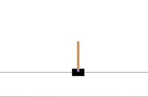

<h3 align="center">
  
</h3>

# CartPole-OpenAI

Reinforcement Learning solution of the [OpenAI's Cartpole](https://gym.openai.com/envs/CartPole-v0/).

## About

> A pole is attached by an un-actuated joint to a cart, which moves along a frictionless track. The system is controlled by applying a force of +1 or -1 to the cart. The pendulum starts upright, and the goal is to prevent it from falling over. A reward of +1 is provided for every timestep that the pole remains upright. The episode ends when the pole is more than 15 degrees from vertical, or the cart moves more than 2.4 units from the center. [source](https://gym.openai.com/envs/CartPole-v0/)
------------------------------------------

- The OpenAI gym python toolkit was used to simulate the environment
- Training and Test examples were also generated using the same
- Neural Network Model was trained on the datasets using the Tensorflow Keras API
- The top score achieved by the model was 10000  which was the limit set by the environment 😁 
- Training Accuracy : 64%
- Test Accuracy : 61%
## Demo

  

## Future Plans

- [] Try to improve the accuracy of the model
- [] Increasing the value of `score_req`(Min score considered for training set examples) for better quality of examples
- [] Check the maximum score the model can achieve 😜

------------------------------------------
## Contributing
Open to `enhancements` & `bug-fixes`
## Note
The project was made just to try out the OpenAI Gym and I hope to solve many more OpenAI Gym Environments.
